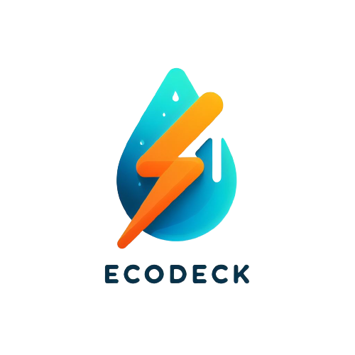

# EcoDeck

## Visão Geral

O **EcoDeck** é um projeto desenvolvido pela equipe da [FATEC Itapira](https://www.fatecitapira.edu.br/), Dr. Ogari de Castro Pacheco, como parte da conclusão do semestre. Este projeto é uma colaboração interdisciplinar que combina conhecimentos de disciplinas-chave, incluindo "Banco de Dados Relacional", "Desenvolvimento Web III", "Técnicas de Programação" e "Gestão Ágil de Projetos de Software". O objetivo principal é aprimorar as habilidades em equipe e aplicar esses conhecimentos na prática.

## 🪧 Sobre o Projeto

O **EcoDeck** é uma solução inovadora que visa fornecer aos usuários um monitoramento contínuo em tempo real do consumo de energia e água em suas residências. Isso é possível através da implantação de sensores inteligentes, combinando hardware (Arduino) com sensores específicos, que são instalados nas casas dos usuários. O projeto é dividido em duas partes: um site e um aplicativo.

### 🎯 Objetivos

- 💡 Monitoramento contínuo e em tempo real do consumo de energia e água.
- 🌐 Portal intuitivo para acesso às informações.
- 💰 Conversão dos valores de consumo em moeda local.
- 🏡 Beneficiar proprietários de casas e autoridades municipais.
- 🌿 Promover o uso eficiente de recursos naturais.
- 🌍 Reduzir o desperdício e contribuir para cidades sustentáveis e inteligentes.

### 🔥 Benefícios

- 💲 Economia de recursos para os usuários.
- 📊 Tomada de decisões mais precisas e resoluções ágeis para as autoridades municipais.
- 🚀 Abordagem proativa que identifica e resolve problemas antes que se tornem graves.
- 👨‍👩‍👦 Contribuição para uma melhor qualidade de vida e um ambiente mais saudável.

## Equipe

- **Product Owner** - [Prefeitura do Município](https://itapira.sp.gov.br/)
- **Scrum Master** - [Luís Felipe](https://github.com/LuisFelipeSalvarani)
- **Time**
  - [Bruno Gomes](https://github.com/BrunoOliveira1989)
  - [João Paulo](https://github.com/Joao-PauloBR)
  - [Tifani Mendonça](https://github.com/timendonca)
- **Orientadores**
  - [José Gonçalves Pinto Junior](https://github.com/jrgoncalves85) | [LinkedIn](https://www.linkedin.com/in/jrgoncalves85/)
  - Ana Célia Ribeiro Bizigato Portes
  - [Mateus Guilherme Fuini](https://github.com/mateusfuini)